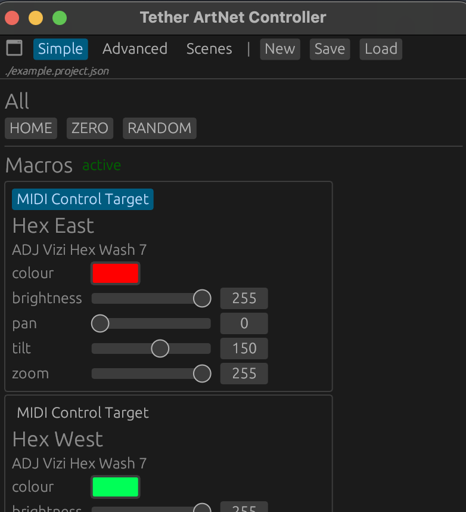

# Tether ArtNet Controller

Sometimes you don't need pixel-mapping, you just need to control some DMX fixtures. **This application works like a lighting desk, but better.**

Runs on Mac, Linux and even Windows.



This application lets you achieve the following:

- fiddle with some sliders to figure out what each channel is doing, without even needing to set up "fixtures" or "mapping" first
- set up a Project with Fixtures, complete with easy-to-access documentation about what each channel does
- define Macros which are labelled shortcuts to the channel(s) you care about most for each kind of Fixture
- set up Scenes which apply Macros to the entire system, either immediately or over time (animated transition)

In addition, the main features above (Macros, Scenes, Animations) can be controlled in multiple ways:

- using a friendly GUI interface
- using a MIDI controller
- using Tether messaging

Use this application for your lighting design in GUI mode, then run with `--headless` to launch as a server which can be controlled remotely via third-party applications. Nice!

## CLI

Get all the available options by appending `--help`

Example: start with connected interface:

```
tether-artnet-controller myproject.json --artnet.interface 10.0.0.100 --artnet.destination 10.0.0.99
```

Example: start with local testing for ArtnetView:

```
tether-artnet-controller --artnet.interface 10.112.10.187 --artnet.destination 10.112.10.187 --loglevel debug
```

## Test Tether control using Tether Egui

If you have Tether Egui installed (`cargo install tether-egui`) then the easiest way to test Tether remote control is to launch Tether Egui with the example project file included, i.e.:
`tether-egui tether-egui-testing.json`

---

## TODO

- [x] Add labels for which channels are already "taken"/assigned in master slider list
- [x] Add indications of "range values" for channels where this applies (under fixture section)
- [x] Allow macros to be (temporarily) disabled so Fixture>Mapping values can be adjusted directly without being overridden
- [x] Add the missing macros/auto sections with range values for both fixture types (left out this detail)
- [x] MIDI (Tether, remote) control
- [x] Allow macro "current values" to be updated remotely via Tether
- [x] Macro Animations on remote messages via Tether
- [x] Provide simple/advanced views (e.g. "macros only" vs "the kitchen sink")
- [x] Scenes should be triggered by Tether messages
- [x] Hit a button to save the current state of all macros to a new Scene
- [x] Project JSON should save ArtNet configuration (but can override via CLI args)
- [x] Colour conversions should be possible manually, e.g. RGB -> CMY
- [x] With macros, add some visual indicators of state, e.g. Colour, Brightness and Pan/Tilt
- [x] Allow the app to launch just fine without Tether
- [x] If no ArtNet provided in Project (and no settings provided from CLI), then do NOT connect, but allow editing / manual connect
- [x] Allow Tether settings to be saved with project as well
- [ ] Add amber Macros for some fixtures (and include these in scenes)
- [ ] Keep project files sorted, e.g. by fixtures
- [x] Allow the app to launch without any project file at all
- [x] Add 16-bit control, at least for macros (single slider adjusts the two channels as split between first and second 8-bit digits)
- [ ] ArtNet on separate thread, with more precise timing; this might require some messaging back and forth and/or mutex
- [ ] It should be possible to add Macros from "Advanced Mode" into the available macros for the fixtures (and therefore the scenes). This would be part of a fixture-editing UI?
